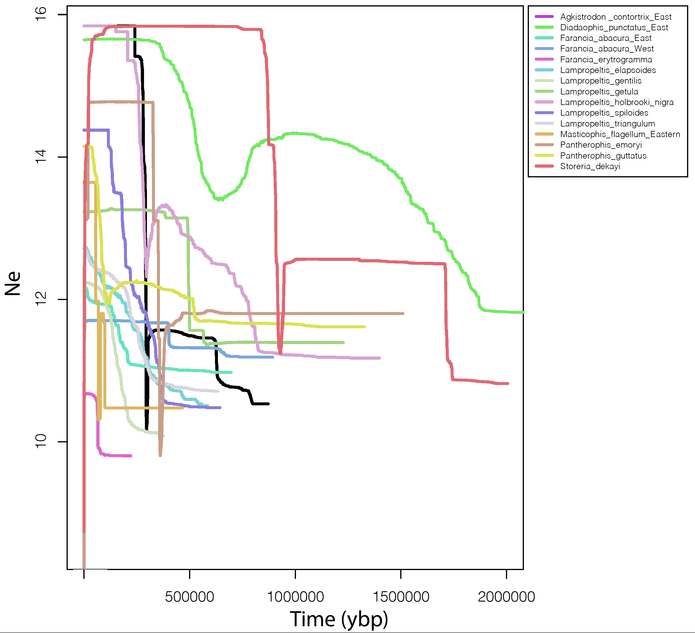

## Pleistocene glaciation drove shared population coexpansion in eastern North American snakes


### Harrington, Overcast, Myers, and Burbrink

<br>
<br>





<br>


This repo contains code used for analyses in the manuscript "Pleistocene glaciation drives shared coexpansion in eastern North American snakes".

Raw sequence data WILL BE AVAILABLE WHEN I UPLOAD THEM TO NCBI!! - Will need to reference the kingsnake raw data already on NCBI.

* All processed data files generated for this study (e.g, output from ipyrad, downloaded bioclim data, etc.) WILL BE available on Dryad at XXXXXXXX

For the milk snakes (*Lampropeltis triangulum* complex), we used the published file `Data_D3_VCF_file_generated_for__Lampropeltis_triangulum_L._gentilis_and_L._elapsoides_from_ipyrad_filtered.vcf` from the [Dryad dataset](https://datadryad.org/stash/dataset/doi:10.5061/dryad.g79cnp5qm) associated with [Burbrink et al. 2022](https://academic.oup.com/sysbio/article/71/4/839/6433690). We renamed this file as `Milks_filtered_snps_taxa.vcf` and it is referred to as such in all scripts.

Some names in this file need to be fixed, which we did using the following commands:

```bash
sed -i '.bak' 's/L_elapsoides_FTB2078/L_gentilis_FTB2078/g' *
sed -i '.bak' 's/L_gentilis_FTB2109/L_elapsoides_FTB2109/g' *
sed -i '.bak' 's/L_triangulum_FTB1538/L_triangulum_FTB1583/g' *
```

We also used a file `milks_denovo-92.vcf` file, which is the output from ipyrad from that manuscript but without filtering the file to a single SNP per locus in R. This file is included on Dryad.


We also used published data for common kingsnakes (*Lampropeltis getula* complex) from [Harrington and Burbrink 2023](https://onlinelibrary.wiley.com/doi/full/10.1111/jbi.14536). We used genetic data files starting `Lgetula_p123_v4_25miss` from [Dryad](https://datadryad.org/stash/dataset/doi:10.5061/dryad.18931zd16).


<br>

## ipyrad data processing

Demultiplexing scripts and files are in the `01_ipyrad_step_1_Demux` directory. `.pbs` scripts were used to run demultiplexing and merging of plates on the American Museum of Natural History (AMNH) computing cluster and using the parameter and barcodes files. Note that paths and node architecture are specific to the AMNH cluster and my my account. Additionally, not all samples in these plates were used for this manuscript. Only params files are included for Farancia species. These are in directory `02_ipyrad_steps_2_to_5`.

Scripts for the next processing steps are in the `02_ipyrad_steps_2_to_5` directory.

Following these steps, `03_ipyrad_branching_steps_6_7` contains scripts to create new ipyrad branches containing only individuals from each species/complex. There are a lot of files here, so these are further organized into directories (if you want to actually run them, I don't think they can be organized this way and all need to be in a single, messy directory). Directories are:

- `03_A_First_branch`:  the first branching script (`ipyrad_branch_species_p123.pbs`) creates separate ipyrad branches for each species with all samples using the respective names files. These initial datasets include low quality samples and samples not included in our analysis of eastern populations for some species/complexes. `pbs` files starting `ipyrad_p123` then run ipyrad steps 6 and 7 on each of these branches, using the species-specific params files made in the branching process.

- `03_B_Second_branch`: This creates new branches for each species/species complex to remove individuals with large amounts of missing data or that are outside of our focal region. The general gist is the same as above. `ipyrad_branch_final_assemblies_p123.pbs` creates new branches using new names files and the params files from `03_A_First_branch`. Each new branch then has new `params` files included in this directory and `.pbs` scripts that run ipyrad step 7 to generate each assembly as used in the analyses.


<br>

## Population clustering, IBD, and GDM in R

Directory `04_R_analyses` contains R scripts used to perform analyses. These scripts are extensively commented.

- `extra_idb_plots.R` generates some additional IBD plots for split up populations of *D. punctatus* and *A. contortrix* that we used when deciding whether or not to  split these populations for Stairwayplot2 and PTA analyses
- `GDM_coexp.R` runs generalized dissimilarity modeling (GDM)
- `get_all_ind_IDs.R` just gets the IDs of all the individuals included and generates some info for the appendix
- `IBD_coexp.R` generates kernel density plots of isolation by distance and prepares bioclim and envirem data for GDM analysis
- `Pop_assign_coexp.R` runs sNMF on assemblies from ipyrad
- `range_figs.R` creates the figure with species/complex ranges with sNMF results plotted onto maps.
- `sNMF_supp_fig.R` makes the supplemental figure showing sNMF cross-entropy and sNMF K=2 for D. punctatus.

<br>

## Stairwayplot2

Directory `05_Stairwayplot2` contains scripts used to prep and run Stairwayplot2.

We used Stairwayplot2 to visualize the population size change through time for each population individually. This allowed us to identify populations as expanding or not expanding. We then only analyzed expanding populations in PTA (see below) to determine if the timing of expansion is synchronous across populations.

The R scripts `make_pops_SFS_stairway.R` and `make_pops_SFS_stairway_MILKS.R` generate population assignment files and individual vcf files for each population according to results from sNMF (output by `Pop_assign_coexp.R` above) or taken from the published "Data_D6_DAPC_TESS_assignments_4_taxa.txt" file in the case of the milk snakes (*L. triangulum* complex) available [here on Dryad](https://datadryad.org/stash/dataset/doi:10.5061/dryad.g79cnp5qm).

These population assignment files, vcf files, and ipyrad stats files were then used as input for the jupyter notebook `eastern_snakes_stairwayplot2.ipynb`. This notebook contains all code to generate the site frequency spectrum (using [EasySFS](https://github.com/isaacovercast/easySFS)) and run Stairwayplot2 on each population.

Mutation rate mentioned in the notebook references [this paper](https://onlinelibrary.wiley.com/doi/full/10.1111/jbi.13114).


R script `make_yarn_plot.R` plots the output from StairwayPlot2 in with lines for population size of each lineage (wich we've been calling a yarn plot). It also makes the supplemental figure of each individual stairwayplot2 output with error shown.

## Phylogeographic Temporal Analysis (`06_PTA_analysis`)
This directory contains jupyter notebooks for reproducing the [PTA](https://github.com/isaacovercast/PTA) comparative phylogeographic co-demographic change analysis.

**Calculate site-frequency spectra and construct the multiSFS using `EasternSnakes-CreateSFS.ipynb`**
This notebook uses the same easySFS based workflow as above to construct the sfs for each population from the output vcf files. All populations within the PTA analysis must be projected down to the same number of samples (here that number is 8). The list of SFS are then converted into PTA **mSFS** format using `PTA.msfs.multiSFS()`, and this is written to a file using the `multiSFS.dump()` function, so that it can be read in to the analysis notebook.

**Perform PTA simulations and machine learning analysis using `EasternSnakes--Simulations--RF-ML-CrossValidation.ipynb`**
This notebook performs the PTA simulations that will be used to train the machine learning model to learn a mapping between PTA parameter values and patterns in the mSFS. `PTA.DemographicModel()` creates the PTA object, and then `set_param()` is called several times to fix values of *known* parameters which are dicated by the data
(e.g. `npops`, `nsamps`, `length`, `muts_per_gen`, etc), and set prior ranges on unknown parameters that we would like to estimate (e.g. `N_e`, `tau`, `epsilon`, etc). Then `model.simulate()` runs the simulation engine in parallel.

After simulations are complete we use `PTA.inference.Classifier` and `PTA.inference.Regressor` (thin wrappers around scikit-learn) to perform random forest cross-validation (validation experiments) for model selection on zeta_e ('effective zeta') and for parameter estimation on model parameters with prior ranges. After validation we interogate the ML models with the empirical mSFS to classify zeta_e and esimtate parameters for the real data.


<br>
<br>


